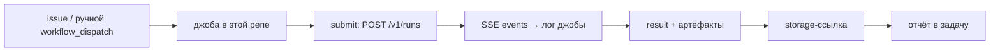

# ai-agent-run-api

**Этот репозиторий = только оркестрация джоб: submit → stream events → result/artifacts.**
Продуктовый код (API, runner, storage) живёт в [trained-assist/ai-agent-runner](https://github.com/trained-assist/ai-agent-runner) и **не копируется сюда**: джобы чекаутят продукт отдельным шагом в `product/` и работают через его публичный контракт. Решение владельца от 01.10.2026: код джоб в ai-agent-runner «не к месту и сбивает» — выносим сюда.

## Модель: что где живёт

| | Где | Что |
|---|---|---|
| Оркестрация джоб | **эта репа** | `.github/workflows/*`, драйверы `scripts/` (submit, стрим событий, result, артефакты, отчёты) |
| Продуктовый код | trained-assist/ai-agent-runner | `src/` — API, runner, storage; чекаутится шагом в `product/`, правки `src/` здесь **не делаются** |
| Продуктовая сборка | берётся из `product/` | `npm ci` в `product/`, tsc-сборка его же `scripts/e2e-loop/tsconfig.build.json` → `product/.e2e-dist` |

Путь к чекауту продукта задаётся env `AGENT_RUNNER_DIR` (дефолт `./product`, относительно текущего каталога).

## Путь джобы



1. **issue / ручной триггер** — `workflow_dispatch` (stress-probe, capability-probe); cron-опрос очереди задач (`agent-task-poll`) придёт отдельным шагом (см. «Вне скоупа»);
2. **джоба** — workflow в этой репе: чекаут этой репы + чекаут продукта в `product/`, `npm ci` в обоих;
3. **submit** — драйвер шлёт `POST /v1/runs` (локальный эфемерный сервер или удалённый API — см. режимы);
4. **SSE events → лог джобы** — события рана стримятся в step-лог GitHub Actions (плюс JSON-отчёт как artifact);
5. **result + артефакты** — `GET .../result`, `GET .../download`;
6. **storage-ссылка** — выгруженный артефакт в storage (share-by-link из slice D1 продукта);
7. **отчёт в задачу** — step summary + JSON-artifact + комментарий к issue.

## Режимы джоб

| | LOCAL-ephemeral | REMOTE |
|---|---|---|
| Что делает | `actions/checkout` продукта + локальный запуск драйверов: драйвер **сам спавнит** эфемерный API-сервер (`scripts/e2e-loop/server.mjs` + собранный `product/.e2e-dist`) | драйверы **не спавнят сервер**, а ходят в наш Serverless API (`RUNNER_API_URL` + `RUNNER_API_KEY`) — стрим через те же `getEvents` |
| Зачем | self-test: фазы fault/reboot/memory, которые убивают/ребутят **свой** процесс и не работают против чужого удалённого сервера | замер реального пути прод-вызова без локального сервера |
| Как включить | дефолт | заданы **оба** env: `RUNNER_API_URL` + `RUNNER_API_KEY` |

**Порядок выбора режима: env > LOCAL.** Если заданы оба значения — REMOTE; если только одно — предупреждение в stderr и LOCAL.

Фазы в REMOTE-режиме:

| Фаза | LOCAL | REMOTE |
|---|---|---|
| `timeline` (submit → running → succeeded → result) | эфемерный сервер | удалённый API |
| `recovery` (смерть сервера → данные читаются) | ✅ | **skip** — требует убийства/рестарта своего процесса |
| `memory` (OOM-kill) | ✅ | **skip** — замер ведётся по своему процессу на хосте джобы |
| `cpu` (burn) | ✅ | ✅ (замер хоста джобы, сервер не участвует) |
| reboot (`step-4b` в e2e-loop) | ✅ (только root) | **skip** — `systemctl reboot` затрагивает хост |
| `e2e-loop` целиком | ✅ | ❌ цикл работает только в LOCAL (нужны kill/restart/reboot и control-эндпоинты дочернего сервера) — драйвер честно выходит с кодом 2 и объясняет |

## Драйверы (`scripts/`)

| Файл | Что делает |
|---|---|
| `stress-probe.mjs` | фазы `--phase timeline\|recovery\|memory\|cpu\|all`, JSON-отчёт `stress-report.json`; `--dry-run` — печатает режим/пути/план без запуска |
| `e2e-loop.mjs` (+ `e2e-loop.sh`) | цикл приёмки шагов 1–7 (submit/идемпотентность, events stream/replay, fault injection, recovery, security-пробы, артефакт, креды), отчёт `e2e-loop-report.json`; `--dry-run` — план без запуска |
| `e2e-loop/server.mjs` | дочерний API-сервер: грузит собранный `product/.e2e-dist` + engine-реестр + download/gateway/`_e2e` control-роуты |
| `e2e-loop/client.mjs` | HTTP + SSE (cursor / Last-Event-ID) + control-клиент — **общий код для LOCAL и REMOTE** |
| `e2e-loop/checks.mjs`, `steps.mjs` | проверки цепочки событий/секретов и шаги 1–7 |
| `e2e-loop/engine-scripts/` | локальные engine-скрипты (probe/artifact/cred/slow) |
| `e2e-loop/tsconfig.build.json` | фоллбэк сборки продуктового `src/`; приоритет — tsconfig **самого продукта** (`$AGENT_RUNNER_DIR/scripts/e2e-loop/tsconfig.build.json`) |
| `driver-mode-and-product-paths.mjs` | выбор режима (env > LOCAL) и путей к продукту/сборке |

Подробности цикла приёмки: [docs/E2E-acceptance-loop.md](docs/E2E-acceptance-loop.md).

## Как запустить локально

```bash
git clone https://github.com/trained-assist/ai-agent-runner.git product   # чекаут продукта рядом
npm ci                 # зависимости этой репы (драйверы — чистый node, без npm-зависимостей)
(cd product && npm ci) # devDependencies продукта: typescript для сборки src/ → product/.e2e-dist

node scripts/stress-probe.mjs --dry-run                 # быстрый self-check: режим/пути/план
node scripts/stress-probe.mjs --phase timeline          # LOCAL: эфемерный сервер, замер timeline
node scripts/e2e-loop.mjs --sudo-policy report          # цикл приёмки целиком (LOCAL)
npm run check                                           # YAML + node --check + dry-run (то же, что CI)
```

REMOTE-прогон локально:

```bash
RUNNER_API_URL=<адрес из variables репы> RUNNER_API_KEY=<ключ из secrets репы> \
  node scripts/stress-probe.mjs --phase timeline
```

## Джобы (`.github/workflows/`)

| Workflow | Триггер | Что делает |
|---|---|---|
| `stress-probe.yml` | `workflow_dispatch` (input `mode: local\|remote`) | замеры лимитов CI: timeline, recovery, CPU burn, opencode через llm-ladder под нагрузкой, сигнатура таймаута, память до OOM (последним шагом); отчёты без секретов → artifact |
| `capability-probe.yml` | `pull_request`, `workflow_dispatch` | что можно гонять в CI: system facts, typecheck+unit продукта, Playwright, opencode headless и через llm-ladder, e2e-цикл, документированный запрет reboot |
| `ci.yml` | `push`, `pull_request` | минимальная валидация этой репы: `ruby -ryaml` по всем workflow, `node --check` драйверов, `--dry-run` |

Во всех джобах: отдельный чекаут продукта (`actions/checkout` с `repository: trained-assist/ai-agent-runner`, `path: product`), `npm ci` в `product/`, драйверы запускаются отсюда с `AGENT_RUNNER_DIR=product`.

## Секреты и переменные

| Имя | Где хранится | Для чего |
|---|---|---|
| `LLM_LADDER_TOKEN` | **secrets этой репы** (уже установлен) | opencode через llm-ladder в stress-probe/capability-probe |
| `RUNNER_API_URL` | **variables этой репы** (Settings → Actions → Variables) | адрес Serverless API, REMOTE-режим |
| `RUNNER_API_KEY` | **secrets этой репы** | Bearer-ключ того же API |

Значения секретов/адреса в файлы и репозиторий не коммитируются — только имена переменных. Без `RUNNER_API_URL`/`RUNNER_API_KEY` джобы идут в LOCAL-режиме (дефолт).

## Вне скоупа этого переноса

- `scripts/fetch-task.mjs` + workflow `agent-task-poll` — дорабатываются параллельной сессией в продукте по [issue #10](https://github.com/trained-assist/ai-agent-runner/issues/10); заберём сюда отдельным шагом **после** её мержа;
- правки кода продукта (`src/`) — нет, только чекаут и вызов;
- удаление джоб/драйверов из продукта — отдельный шаг **после** зелёных джоб здесь.
